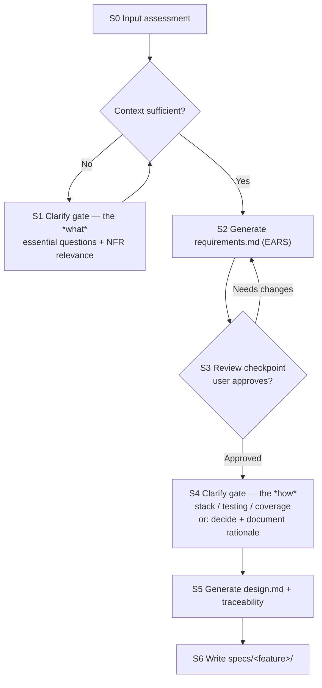

# spec-forge

Turn an initial prompt into a versionable SDD specification: `requirements.md`
(EARS, the *what*) and `design.md` (technical, the *how*). Ask precise clarifying
questions only when the context is genuinely insufficient. **Never generate code**
— stop at design.

## Core principles

- **Two artifacts, always.** The deliverable is `requirements.md` + `design.md`.
- **Requirements are technology-free.** Any stack/library/database detail the user
  mentions is deferred to `design.md`. `requirements.md` describes behavior only.
- **English output.** Generate both files in English regardless of the prompt's
  language.
- **Ask only what's essential.** Never ask about anything inferable from what the
  user already gave you. No generic questionnaires.
- **Two gates, one checkpoint.** A clarify gate before requirements, a review
  checkpoint after requirements, and a clarify gate before design. Do not skip
  ahead.
- **Strip the scaffolding.** The templates contain instructional blockquotes and
  {{placeholders}} meant for you, not for the user. Remove every instructional
  blockquote and replace every placeholder before writing the files. A generated
  spec must contain no trace of the template.

## State machine

Follow these states in order. Each gate/checkpoint is blocking.

---

### S0 — Input assessment

Before anything else, decide whether the prompt is sufficient. The check is
**behavioral, not keyword-based**. Ask yourself whether you can:

1. **Name the feature** (a clear core noun/scope).
2. **List its core behaviors** (what it must do).
3. **Identify success criteria** (how you'd know it works).

If all three are answerable from the prompt (plus obvious inference), the context
is sufficient → go to **S2**. If any is missing or ambiguous → go to **S1**.

Also at S0:
- **Multiple distinct features?** If the request spans several unrelated features,
  suggest splitting them into separate specs and confirm scope before proceeding.

### S1 — Clarify gate (the *what*)

Stay here until essential ambiguities are resolved. **Do not write any file while
in this state.**

- Ask **only the essential** questions needed to remove ambiguity about feature
  scope, core behaviors, and success criteria. Skip anything inferable.
- Batch related questions together; keep the list short and specific.

**NFR relevance (part of this gate).** If the user did not state non-functional
requirements, do **not** run a blanket checklist. Instead map context signals to
categories and ask only about matched ones:

| Context signal | NFR category to raise |
|---|---|
| User-facing or serves a specific audience | Accessibility |
| Large scale / high volume implied | Performance, Scalability |
| System leaves a local or trusted boundary (network, external users) | Security |
| A running service (not a one-off script) | Observability (logging/monitoring) |

- If the user **did** state NFRs, record them as dedicated EARS requirements.
- If a category doesn't match the context, **omit it** — no boilerplate.
- Only raise observability when the target is a running service; skip it for
  one-off scripts.

When the answers make the three S0 questions answerable, proceed to **S2**.

### S2 — Generate requirements.md (EARS)

**Before writing, read `${CLAUDE_SKILL_DIR}/references/ears-notation.md`** to
apply the five EARS patterns correctly.

Fill `${CLAUDE_SKILL_DIR}/assets/requirements-template.md`. Rules:

- **Every functional requirement uses EARS notation**, tagged with its pattern
  (`[UBIQUITOUS]`, `[EVENT]`, `[STATE]`, `[UNWANTED]`, `[OPTIONAL]`).
- Include **acceptance criteria** and cover **edge cases and error conditions**.
- For every **failure-prone operation** (external dependency, I/O, network,
  parsing), add an **unwanted-behavior** (`IF … THEN`) requirement describing the
  expected error/exception behavior, and place it in the template's
  **"Error & exception behavior"** section.
- Record only the **relevant** NFRs (from S1) as dedicated EARS requirements — no
  generic boilerplate.
- Treat error handling, logging, and observability as **behavior/NFRs in the
  spec**, not implementation deferred entirely to code.
- **Keep it technology-free.** If the user's prompt included implementation
  details (stack, library, database), do **not** put them here — set them aside
  for `design.md`.

Then go to **S3**.

### S3 — Requirements review checkpoint

Present the drafted requirements to the user for review **before** producing any
design. This is blocking.

- If the user requests changes → revise and re-present (loop back into S3).
- If the user **approves** → proceed to **S4**.

Do not start the design until requirements are explicitly approved.

### S4 — Clarify gate (the *how*)

Ask the **essential technical questions** needed to shape the design — typically:

- Preferred **stack / language / platform** (and any fixed constraints).
- **Testing approach** and **coverage** expectations.
- Any implementation details the user already mentioned (carry them here now).

**If the user declines a given technical choice**, decide it yourself based on the
approved requirements, and **document the decision and its rationale** in
`design.md`. Don't block on preferences the user is happy to delegate.

When technical direction is set, proceed to **S5**.

### S5 — Generate design.md + traceability

Fill `${CLAUDE_SKILL_DIR}/assets/design-template.md`. Cover:

- **Architecture**, **components**, **data flow**.
- **Testing strategy** (levels, coverage).
- **Technical decisions** with rationale — including any choices you made on the
  user's behalf and why (from S4).
- All implementation details deferred from requirements live **here**.

**Traceability is mandatory.** Complete the *Requirement → design traceability*
table so **every functional requirement group maps to at least one design
element**. If a requirement has no home, add the missing design element — do not
leave it unmapped.

Then go to **S6**.

### S6 — Write the artifacts

- Derive a **kebab-case feature name** from the core feature noun (e.g. "user
  login" → `user-login`). If scope is ambiguous, confirm the name with the user.
- Write both files to `specs/<feature-name>/` as `requirements.md` and
  `design.md`.
- **Overwrite guard:** if `specs/<feature-name>/` already exists, **warn the user
  and request confirmation before overwriting.** Do not silently overwrite.

After writing, briefly summarize what was produced and where.

---

## Guardrails checklist (verify before finishing)

- [ ] Both `requirements.md` and `design.md` were produced.
- [ ] Every functional requirement is valid EARS, tagged with its pattern.
- [ ] `requirements.md` contains **no** technology decisions.
- [ ] NFRs appear only where context-relevant — no boilerplate.
- [ ] Error/exception behavior captured for every failure-prone operation.
- [ ] Requirements were reviewed and approved before design (S3).
- [ ] Traceability table maps every requirement group to a design element.
- [ ] Artifacts written to `specs/<feature-name>/`, overwrite confirmed if the
      folder already existed.
- [ ] Template scaffolding removed from the output — no instructional
      blockquotes, no unfilled `{{placeholders}}`.
- [ ] Output is in English.
- [ ] No implementation code was generated, and no `tasks.md` breakdown.

## Out of scope

This skill stops at design. It does **not** generate implementation code, does
**not** produce a task breakdown (`tasks.md`), and does **not** execute or
validate generated code.