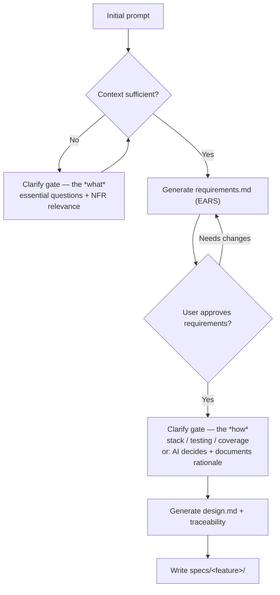

# Design — spec-forge

> Technical design for the `spec-forge` skill. Describes *how* the skill is built
> and behaves, satisfying the requirements in `requirements.md`. No implementation
> code lives here — this is the blueprint.

## Overview

`spec-forge` is a **Claude Code folder skill**: a `SKILL.md` file plus supporting
assets. It has no separate runtime, server, or process. It runs entirely inside
Claude Code through progressive disclosure — its metadata sits in context at all
times, its body loads when the skill triggers, and its bundled resources load only
when needed. In short: the skill is a set of instructions and templates that steer
Claude through the SDD requirements-and-design workflow.

## Skill anatomy

```
spec-forge/
├── SKILL.md                       # required: trigger + workflow instructions
├── references/
│   └── ears-notation.md           # the 5 EARS patterns, loaded when writing requirements
└── assets/
    ├── requirements-template.md   # skeleton the skill fills for the "what"
    └── design-template.md         # skeleton the skill fills for the "how"
```

Progressive disclosure maps onto this directly: the `description` frontmatter is
always in context (~100 words), the `SKILL.md` body loads on trigger, and
`references/` and `assets/` load only at the step that needs them — keeping the
always-on footprint small.

## Components

**`SKILL.md` frontmatter — the trigger.** The `description` field is the sole
triggering mechanism: Claude Code decides whether to consult the skill based on it.
It must state both what the skill does and when to use it, and lean slightly
"pushy" to avoid under-triggering — e.g. covering phrases like *"write a spec",
"turn this into requirements", "spec-driven", "EARS", "requirements and design",*
even when the user doesn't say "spec-forge" explicitly.

**`SKILL.md` body — the workflow.** Contains the state machine below, the two
clarification gates, and the rules for keeping requirements technology-free.

**`references/ears-notation.md`.** The EARS ruleset the skill consults while writing
requirements: the five patterns (ubiquitous, event-driven, state-driven,
unwanted-behavior, optional) with templates and examples. Loaded only during the
requirements step.

**`assets/*-template.md`.** The output skeletons the skill fills. They enforce a
consistent structure across every generated spec (sections, headings, traceability
table).

## Execution flow (state machine)



The flow has **two clarification gates** by design: one before requirements (removing
ambiguity about the *what*) and one before design (settling the *how*). Each gate asks
only the essential questions and lets inferable details pass through.

## Technical decisions

**Vague-prompt detection.** Before generating, the skill checks whether it can (a) name
the feature, (b) list its core behaviors, and (c) identify success criteria from the
prompt. If any is missing or ambiguous, it enters the clarify gate. This keeps the
check behavioral rather than keyword-based, so it generalizes across domains.

**NFR relevance heuristics.** When the user omits non-functional requirements, the skill
maps context signals to categories instead of applying a blanket checklist:
user-facing or audience-specific software → accessibility; implied large scale →
performance/scalability; the system crossing a local or trusted boundary → security.
Only matched categories are raised as questions; unmatched ones are omitted to avoid
boilerplate.

**Quality as behavior.** Failure-prone operations (external calls, I/O) get an explicit
unwanted-behavior EARS requirement for error/exception handling. Observability is raised
only when the target is a running service, not a one-off script.

**Feature-name derivation.** The skill derives a kebab-case folder name from the core
feature noun (e.g. "user login" → `user-login`) and confirms it with the user when the
scope is ambiguous.

**Overwrite handling.** Before writing, the skill checks whether `specs/<feature-name>/`
already exists; if so, it warns and requests confirmation rather than silently
overwriting.

**Output language.** Generated specs are always written in English, regardless of the
prompt's language, for consistency and industry alignment.

## Testing strategy

Because the skill's output is partly subjective, it is verified with example-prompt runs
rather than fixed assertions. The minimum viable test set:

- A **well-specified** prompt → expect both files generated with no unnecessary questions.
- A **vague** prompt → expect essential clarifying questions before any file is written.
- A prompt with **implementation details in it** → expect those details to land in
  `design.md`, leaving `requirements.md` technology-free.
- A prompt implying **large scale / external exposure** → expect the relevant NFR questions
  to surface (and irrelevant ones to stay absent).

Each run is checked for: valid EARS on every functional requirement, no technology in
requirements, and a complete requirement → design traceability table.

## Requirement → design traceability

| Requirement group (`requirements.md`) | Satisfied by (design element) |
|---|---|
| Activation & input assessment | `description` trigger + input-assessment step |
| Clarification gate (the *what*) | Clarify-what state + vague-prompt detection |
| Requirements generation | Requirements step + `ears-notation.md` + requirements template |
| NFR (relevance-gated) | NFR relevance heuristics |
| Quality & robustness | Error-behavior rule + observability relevance check |
| Requirements review checkpoint | Review-checkpoint state |
| Design clarification & generation | Clarify-how state + design step + design template |
| Artifact output | Write step + feature-name derivation + overwrite handling |